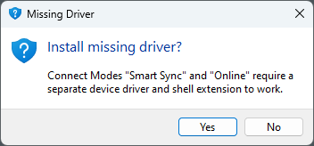

Installation
====

::::::{tabs}
:::::{group-tab} macOS

**Download ZIP**

Move the unzipped application bundle *Mountain Duck.app* from the Downloads to the `/Applications` folder on your computer.

:::{note}
No admin privileges for installation are required.
:::

:::{tip}
Mountain Duck is available in the [Mac App Store](https://mountainduck.io/buy/macappstore).
:::

:::::
:::::{group-tab} Windows

**Installer**

[Download](https://mountainduck.io/changelog/) the *MSIX Installer Package* to install Mountain Duck.

:::{note}
No admin privileges for installation are required.
:::

:::{tip}
Mountain Duck is available in the [Windows Store](https://mountainduck.io/buy/windowsstore).
:::

:::{tip}
You can perform system-wide installations using the command in an elevated PowerShell window:
```
Add-AppxProvisionedPackage -Online -SkipLicense -PackagePath "Mountain Duck_5.0.1.27950_x64.msix"
```

Alternatively, with the `Path` argument pointing to a _Windows Disk Image_ file: 
```
Add-AppxProvisionedPackage -Path X:\MounatedWindowsImage -SkipLicense -PackagePath "Mountain Duck-5.0.1.27950_x64.msix"
```
:::

:::::
::::::

#### Extensions

:::::{tabs}
::::{tab} macOS Finder Sync Extension

Enabling the _Mountain Duck Finder Extension_ is required for *[Context menu items](../connect/sync.md#context-menu-options)* and sync status as *[Badges](../connect/sync.md#status-of-files)* on file icons in Finder.app for _Smart Synchronization_ and _Online_ [connect mode](../connect/index.md):

- Enable _Mountain Duck_ in _System Settings → General → Login Items & Extensions → Allow in the Background_
  :::{image} _images/System_Settings_Background.png
  :alt: System Settings
  :width: 500px
  :::

- Enable _Mountain Duck Helper_ in _System Settings → General → Login Items & Extensions → File Providers_
  :::{image} _images/System_Settings_Helper.png
  :alt: System Settings
  :width: 500px
  :::

:::{tip}
Technically the extension is a _Finder Sync_ extension inside _Mountain Duck Helper_ albeit listed in the _file Providers_ category.
:::

::::
::::{tab} macOS File Provider Extension

Enabling the _Mountain Duck File Provider_ extension is always required for _Integrated_ [connect mode](../connect/index.md). Select _Mountain Duck_ in _System Settings → General → Login Items & Extensions → File Providers_
  :::{image} _images/System_Settings_File_Provider.png
  :alt: System Settings
  :width: 500px
  :::

::::
:::::

## System Requirements

:::::{tabs}
::::{group-tab} macOS

- Mountain Duck 5.0.0 or later requires *macOS 13* or later
- Mountain Duck 4.14 or later requires *macOS 10.13* or later
- Mountain Duck 3.3.5 or later requires *macOS 10.12* or later
- Mountain Duck 3.0.1 or later requires *macOS 10.11* or later

::::
::::{group-tab} Windows

Requires *.NET Framework 4.7.2.* If the {download}`.Net Framework installation<https://dotnet.microsoft.com/download/dotnet-framework/net472>` fails, download it manually.

- Mountain Duck 5.0.0 or later requires *Windows 10 1809 (17763)* or later.
- Mountain Duck 4.13.0 or later requires *Windows 10 (14393) or Windows Server 2016* or later on 64 Bit.
- Mountain Duck 3.2.0 or later requires *Windows 7, Windows 8.1, Windows 10 (14393)* or later on 64Bit.
- Mountain Duck 3.0.1 or later requires *Windows 7* or later.

::::
:::::

## Registration Key

Double-click the file `.mountainducklicense` to apply the license and register Mountain Duck. Alternatively, you can copy the key file to the [application support folder](../support/index.md#application-support-folder).

:::::{tabs}
::::{group-tab} macOS

You can manually install the registration key in

- `~/Library/Group Containers/G69SCX94XU.duck/Library/Application Support/duck/`

::::
::::{group-tab} Windows

You can install the registration key either in:

- `%AppData%\Cyberduck`
- `C:\Program Files\Mountain Duck`

::::
:::::

### Known Issues

#### Not a Valid Registration Key

This error message appears if you try to use an old license key for a newer version.
[Upgrade](https://mountainduck.io/buy/upgrade/) your license to the latest version of Mountain Duck or download an older version from [Mountain Duck changelog](https://mountainduck.io/changelog/).

### Windows Installation

#### Optional Driver Installation
Connecting using [_Online_](../connect/online.md) or [_Smart Synchronization_](../connect/sync.md) connect mode requires the installation of an additional file system driver in Windows. The following prompt is displayed when attempting to connect the first time.



:::{tip}
The installation of the file system driver is not required for [_Integrated_](../connect/integrated.md) connect mode.
:::

#### Error Code 0x24C 

If you get the error code `0x24C` uninstall the client, reboot the system, and reinstall the client.

```
0x24C. A volume has been accessed for which a file system driver is required that has not yet been loaded.
```

#### Troubleshooting 

For troubleshooting purposes when reaching out for support, please share the latest installation log. The installation log file prefixed `Mountain Duck_` can be found in `%Temp%`.

## Installation with Device Management Software

You can distribute Mountain Duck with the help of Active Directory or a system management tool like Intune on Windows or JAMF on macOS and copy the license file into the [application support folder](../support/index.md#application-support-folder) after installing Mountain Duck. Installation packages are provided in MSI (Windows) and PKG (macOS) formats.

### Defaults

- Add preconfigured connection profiles and bookmarks this way by copying the connection profile file (`.cyberduckprofile`) into the *Profiles* folder or the bookmark file (`.duck`) into the *Bookmarks* folder within the [application support folder](../support/index.md#application-support-folder).
- Share default settings by using the [default.properties file](../preferences.md#hidden-configuration-options). 

### Uninstall application and application data

Follow the steps below to uninstall Mountain Duck completely.

:::::{tabs}
::::{group-tab} macOS

1. Close the application and navigate to the application folder using the shortcut `⌘⇧A`. Select *Mountain Duck.app* and delete the application by choosing *File → Move to Trash*.
2. Navigate to the *Group Containers* folder within *~/Library/* and delete the folder *G69SCX94XU.duck*. If you changed the cache location you will have to delete that folder as well.
3. Run the _Terminal.app_ command to reset and erase the settings for Mountain Duck:
	`defaults delete io.mountainduck`
4. **Optional:** Delete all saved login credentials regarding Mountain Duck within *Keychain Access.app*.

::::
::::{group-tab} Windows

1. Close the application and open the start menu using the shortcut `Ctrl Esc`. Search for *Apps & Features* and move to the entry *Mountain Duck*. Click on the application, choose *Uninstall*, and confirm your intentions by clicking *Uninstall* again.
2. Navigate to the `%AppData%`and delete the folder *Cyberduck*
3. Navigate to `%LocalAppData%`and delete the folder *Cyberduck*
4. **Optional:** Delete all saved login credentials regarding Mountain Duck within *Windows Credential Manager*.

::::
:::::